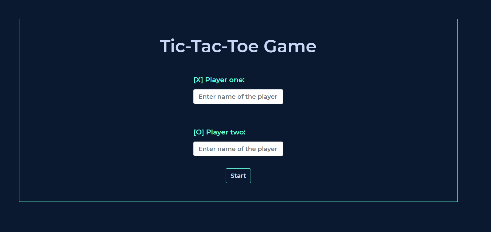
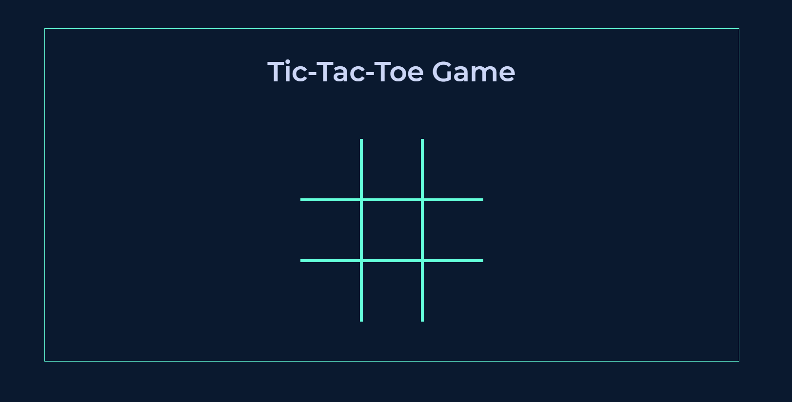
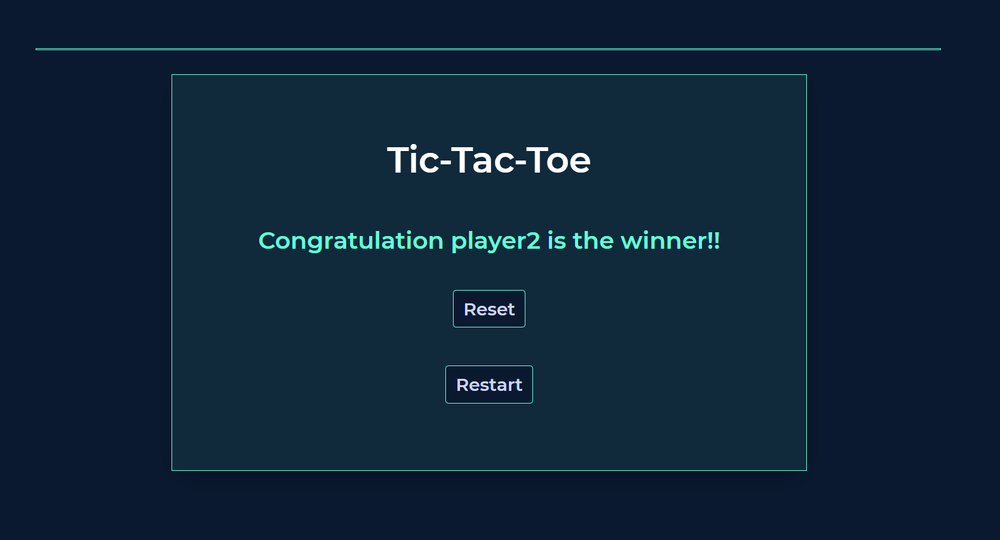
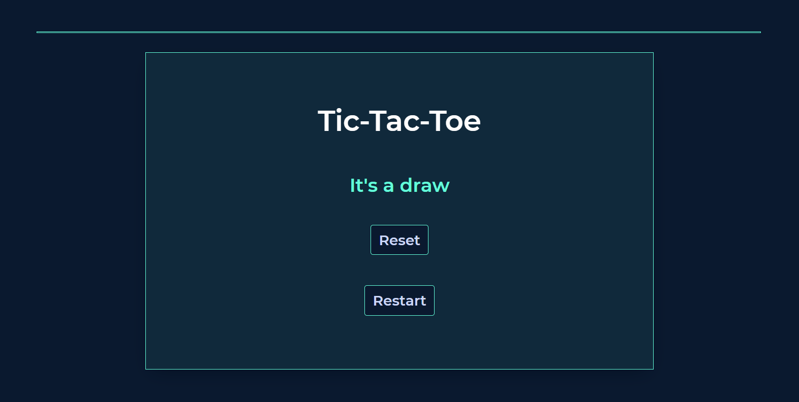

# Tic-Tac-Toe ON JS

[![Contributors][contributors-shield]][contributors-url]
[![Forks][forks-shield]][forks-url]
[![Stargazers][stars-shield]][stars-url]
[![Issues][issues-shield]][issues-url]

In this project,we are building a Tic Tac Toe game made on Javascript.The tic-tac-toe game is created to play on the command line where two human players can play against each other and the board is displayed in between turns

### Landing Page



### Game Board



### Winning



### Draw



## Live Demo

- [Production](https://rawcdn.githack.com/Cyrus-Kiprop/Javascript-Tic-Tac-Toe/f3ed416b343afbbd657355b035dff5a80fe92a04/index.html)

- [Deployment](https://raw.githack.com/Cyrus-Kiprop/Javascript-Tic-Tac-Toe/master/index.html)

## Built With

```sh
Front-End(client)
```

- HTML + CSS
- JavaScript
- Bootstrap

```sh
Testing Frameworks
```

- Jest

## Getting Started

To get a local copy up and running follow these simple example steps.

### Prerequisites

- Node

- Basic knowledge of npm/yarn

### Installation

1. Clone the repo

```sh
git clone https://github.com/Cyrus-Kiprop/Javascript-Tic-Tac-Toe.git
```

2. CD into the project root directory

```sh
cd ./Javascript-Tic-Tac-Toe.git
```

3. Install Dependencies and packages

```sh
npm install
```

4. Build the files

```sh
npm run build
```

<!-- USAGE EXAMPLES -->

## Usage

Open the index.html file using live servers.

```sh
right click on index.html file and open it with the browser or with live server.
```

### Navigate to your browser and open port 8080 (use your live server port):

```JS
http//localhost:8080
```

### Enjoy the game

# Rules

1. The game is played on a grid that's 3 squares by 3 squares.

2. You are X, your friend (or the computer in this case) is O. Players take turns putting their marks in empty squares.

3. The first player to get 3 of her marks in a row (up, down, across, or diagonally) is the winner.

4. When all 9 squares are full, the game is over. If no player has 3 marks in a row, the game ends in a tie.

Top-Left Top-Center Top-Right
Middle-Left Middle-Center Middle-Right
Bottom-Left Bottom-Center Bottom-Right

# How to play

When you start the game, it's going to ask the name of the player1 and player2, and immediately after, a match will start.
You can play as many matches as you want in a single game, and the game is going to show a Winners or a Draw depending on the game result.

## Making a move

We have 9 cell on the board as represented below.

    |1|2|3|
    |4|5|6|
    |7|8|9|

The Player1 will start the game with 'X' mark on any of the 9 cell, once the player makes his change, the user gets toggled to player2 and so on. You can't re-assign a cell once you make the move or once the mark is placed for either 'X'or'O'.

## Ending the game

The match is over if the winnning critera is met, or else the match will be a draw. One east result user gets an option to either 'Reset' or 'Restart' the game.

Reset - The data of Players will be not saved and the user need to provide the entire data once more at the beggining.
Restart- The player is taken back to thr board, and the players can replay the game.

## Roadmap

See the [open issues](https://github.com/Cyrus-Kiprop/Javascript-Tic-Tac-Toe/issues) for a list of proposed features (and known issues).

<!-- CONTRIBUTING -->

## Contributing

Contributions are what make the open source community such an amazing place to be learn, inspire, and create. Any contributions you make are **greatly appreciated**.

1. Fork the Project
2. Create your Feature Branch (`git checkout -b feature/NewAwesomeFeature`)
3. Commit your Changes (`git commit -m 'Add some NewAmazingFeature'`)
4. Push to the Branch (`git push origin feature/NewAmazingFeature`)
5. Open a Pull Request

## Authors

👤 **Cyrus Kiprop**

- Github: [Cyrus-Kiprop](https://github.com/Cyrus-Kiprop)
- Twitter: [@kipropJS](https://twitter.com/kipropJS)
- Linkedin: [Cyrus Kiprop](https://www.linkedin.com/in/cyrus-kiprop-ba7320120/)

👤 **Shubham Raj**

- Github: [@ShubhamRaj](https://github.com/shubham14p3)
- Linkedin: [Shubham14p3](https://www.linkedin.com/in/shubham14p3/)

## Show your support

Give a ⭐️ if you like this project!

## Acknowledgments

- Project requested by [Microverse Program](https://www.microverse.org/).

## Future Enhancement

- Adding Validation.
- Adding AI Logic.
- Making the UI, Mobile friendly.

<!-- MARKDOWN LINKS & IMAGES -->

[contributors-shield]: https://img.shields.io/github/contributors/Cyrus-Kiprop/Javascript-Tic-Tac-Toe.svg?style=flat-square
[contributors-url]: https://github.com/Cyrus-Kiprop/Javascript-Tic-Tac-Toe/graphs/contributors
[forks-shield]: https://img.shields.io/github/forks/Cyrus-Kiprop/Javascript-Tic-Tac-Toe.svg?style=flat-square
[forks-url]: https://github.com/Cyrus-Kiprop/Javascript-Tic-Tac-Toe/network/members
[stars-shield]: https://img.shields.io/github/stars/Cyrus-Kiprop/Javascript-Tic-Tac-Toe.svg?style=flat-square
[stars-url]: https://github.com/Cyrus-Kiprop/Javascript-Tic-Tac-Toe/stargazers
[issues-shield]: https://img.shields.io/github/issues/Cyrus-Kiprop/Javascript-Tic-Tac-Toe.svg?style=flat-square
[issues-url]: https://github.com/Cyrus-Kiprop/Javascript-Tic-Tac-Toe/issues
